# SysML Modelleyici

Kurulum gerektirmeyen, internetsiz çalışan, Cameo benzeri hafif bir **SysML modelleme aracı**.
SysML'in 9 diyagram türü, model ağacı, gereksinim yönetimi ve izlenebilirlik, kapsama analizi, Excel içe/dışa aktarma, otomatik düzen ve ikon kütüphanesi içerir.
Kapalı ağdaki, yönetici yetkisi olmayan bilgisayarlarda çalışmak üzere tasarlandı.

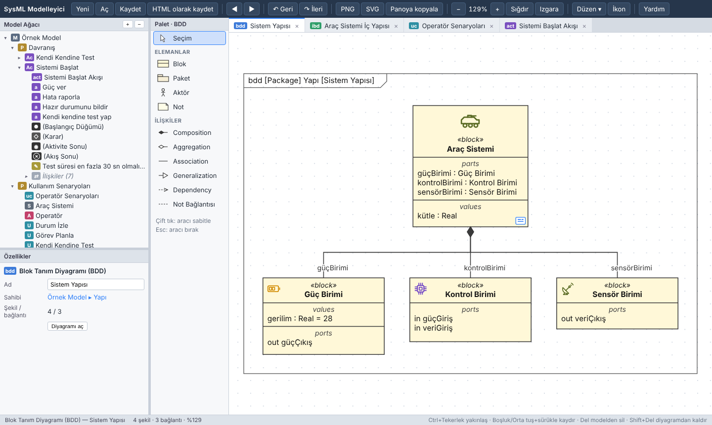

## Öne çıkanlar

- **9 SysML diyagram türü:** Blok Tanım (BDD), İç Blok (IBD), Use Case, Aktivite, Gereksinim, Durum Makinesi, Sıralama (Sequence), Parametrik, Paket
- **SysML dil desteği:** arayüz blokları ve akış özellikleri, eşlenik portlar, değer tipleri ve SI birim kütüphanesi, numaralandırma, sinyal, kullanıcı tanımlı **stereotipler ve etiket değerleri**, pin ve aktivite parametreleri, sinyal gönder/olay kabul, kesilebilir bölge, sıralama diyagramında **fragmentler (alt/opt/loop/par…)** ve yürütme çubukları, **bileşik durumlar**, bölge ve geçmiş düğümleri
- **Gereksinim yönetimi:**
  - Sistem ve alt sistem gereksinimleri için düzenlenebilir tablo: ID, başlık, metin, seviye, **alt sistem adı**, doğrulama yöntemi (Test / Analiz / Muayene / Gösterim), müşteri ister no ve isteri; sistem / alt sistem adına göre filtreleme
  - İstenen kadar özel özellik (attribute) ekleme, çıkarma ve yeniden adlandırma; sütun gizleme
  - Sistem → alt sistem türetme (Derive), model elemanı ve fonksiyon karşılama (Satisfy), test doğrulama (Verify) izlenebilirliği
  - **İzlenebilirlik matrisi:** sistem × alt sistem, gereksinim × fonksiyon, gereksinim × blok, test, use case; hücreye tıklayarak ilişki kurma
  - **Kapsama analizi:** karşılanmayan sistem gereksinimleri, üst gereksinimi olmayan (yetim) alt sistem gereksinimleri, doğrulama yöntemi eksikleri, gereksinime izlenmeyen bloklar ve fonksiyonlar
  - **Excel:** `.xlsx`/`.csv` içe aktarma (sütunlar otomatik eşleşir, bilinmeyenler yeni özellik olur, üst gereksinim ID'leri ilişkiye dönüşür); **sütun (attribute) seçimiyle** `.xlsx`, Word gereksinim spesifikasyonu ve ReqIF dışa aktarma
- **Gereksinim kalitesi ve konfigürasyon yönetimi:** INCOSE kurallarıyla kalite denetimi (Türkçe "-ecek / -acak / -ecektir / -acaktır" cümle sonu kuralı), durum iş akışı (Taslak → Onaylı → Değişiklikte), gerekçeli değişiklik geçmişi, taban çizgileri ve karşılaştırma, etki analizi
- **Doğrulama yönetimi:** test durumu alanları (prosedür, seviye, tarih, sonuç, rapor no), **VCRM**, gereksinim bazında doğrulama durumu, **test kampanyası zaman çizelgesi (Gantt)**, test sonuçlarını Excel'den geri alma
- **Çevresel test profilleri:** rastgele titreşim (PSD → Grms, yer değiştirme), sinüs süpürme, şok tepki spektrumu (SRS) ve termal döngü profilleri; tolerans bantları, profil karşılaştırma ve marj, zarf oluşturma; test durumlarına, VCRM'e ve rapora bağlı
- **Arayüz yönetimi:** IBD bağlantılarından **N² arayüz matrisi** (part veya blok düzeyinde) ve **arayüz kontrol tablosu (ICD)**: kaynak/hedef, yön, arayüz bloğu ve akış öğeleri, tür, protokol, konnektör; yön/tip/birim **uyumsuzluk denetimi**; Excel ve Word ICD
- **Şartnameden gereksinim çıkarma:** Word/metin şartnameden zorunluluk cümlelerini bölüm ve ister numaralarıyla bulup önizleyerek ekleme
- **Model karşılaştırma ve inceleme:** iki model dosyası arasında eleman bazında fark (kimlik veya yol eşleştirmesi), farkları seçerek uygulama; elemanlara yanıtlanabilir inceleme notları ve diyagramda rozet
- **Akıllı "+" düğmesi:** seçili bloğa part, reference, value, flow property ve port ekleme; yeni veya var olan bloklarla Composition, Aggregation, Association, Generalization, Dependency ilişkisi kurma
- **Kullanım kolaylığı:** `Ctrl+K` komut paleti, karanlık tema, durum geçiş tablosu ve durum × olay matrisi, seçili eleman için "kullanıldığı yerler"
- **Güvenilirlik ve risk:** FMEA / FMECA tablosu (Ş×O×T = RPN, önlem sonrası RPN, MIL-STD-1629A kritiklik Cm ve Cr), arıza modundan önleyici gereksinime ve teste izlenebilirlik, risk kaydı ve önlem öncesi/sonrası 5×5 risk matrisi
- **Analiz ve simülasyon:** parametrik denklem çözücü, kütle/güç/maliyet **bütçe toplama** ve marj, aktivite ve durum makinesi **simülasyonu**, tahsis matrisi, genel düzenlenebilir tablolar, ilişki haritası
- **Araçlar:** **Word (.docx) ve yazdırılabilir HTML rapor**, model doğrulama kuralları, başka modelle birleştirme, **ReqIF** içe/dışa aktarma (DOORS, Polarion…)
- **Cameo / MagicDraw ile alışveriş:** **XMI** içe/dışa aktarma (UML 2.5 / SysML 1.6), içe aktarılan model için otomatik diyagramlar
- **Şablonlar:** MIL-STD-810H ve SMC-S-016 kalifikasyon gereksinimleri ve test durumları, proje iskeleti
- **Model ağacı:** Diyagramda yapılan her değişiklik ağaca anında yansır. Bir eleman birden çok diyagramda gösterilebilir.
- **Diyagrama özel palet:** Açık diyagramın türüne göre elemanlar ve ilişkiler; sürükle-bırak veya tıkla-yerleştir
- **Modelle senkron davranışlar:**
  - BDD'de Composition/Aggregation çizilince bütün blokta otomatik *part* oluşur.
  - IBD açılınca bloğun part, port ve connector'ları kendiliğinden yerleşir.
- **İç içe diyagramlar:**
  - Çift tıklamayla alt diyagrama geçilir: bloktan IBD'ye, aksiyondan çağırdığı aktiviteye, use case'ten akışına.
  - ◀ ▶ düğmeleriyle önceki ve sonraki diyagrama dönülür.
- **Engelden kaçan bağlantılar:** Bağlantılar elemanların üzerinden geçmez, aynı kenara gelenler ayrı noktalara dağılır.
- **Otomatik düzen:** Diyagram türüne göre hiyerarşik, akış, kulvarlı, aktörler-solda, ızgara, dairesel ve "toparla" düzenleri; hizalama ve dağıtma araçları
- **İkon kütüphanesi:** 10 kategoride 200'ü aşkın ikon (otomotiv, havacılık ve uzay, bilgisayar, savunma, enerji, sensör ve haberleşme, mekanik, yazılım, organizasyon, genel)
- **Dışa aktarma:** Diyagramlar SysML çerçevesiyle PNG/SVG, tek veya çok sayfalı **PDF** olarak kaydedilebilir ya da panoya resim olarak kopyalanıp Word/PowerPoint'e yapıştırılabilir.
- **Editör kolaylıkları:** bağlantılarda elle bükme noktaları ve eğik çizgi, taşınabilir etiketler, mini harita, biçim boyacısı, lejant
- **Kayıt:**
  - Otomatik kayıt
  - `.sysml` (JSON) model dosyası
  - Modeli içine gömülü, tek dosyalık HTML (paylaşım için)
- **Düzenleme:** kopyala/yapıştır/çoğalt, model içinde arama (`Ctrl+F`), ağaçtan çoklu sürükleme, bağlantı ucunu yeniden bağlama, renk ve bölme görünümü, yatay kulvar
- **Geri al / yinele**, yakınlaştırma, ızgara, çoklu seçim, kısayollar

## İndirme ve çalıştırma

İki sürüm vardır; ikisi de aynı uygulamadır ve aynı model dosyalarını açar.

| Sürüm | Dosya | Nasıl çalışır |
|---|---|---|
| **Masaüstü (Windows)** | `SysMLModelleyici.exe` ([Releases](../../releases) sayfasından) | Çift tıklayın. Kurulum ve yönetici yetkisi gerekmez; kendi penceresinde açılır. Windows dosya pencereleriyle kaydeder. |
| **Tarayıcı** | [`app/sysml-modeler.html`](app/sysml-modeler.html) | Dosyayı indirip Edge veya Chrome ile açın. İnternet gerekmez. |

> Exe sürümü ekranı göstermek için Windows'ta yerleşik gelen **Microsoft Edge WebView2** bileşenini kullanır (Windows 10/11'de normalde yüklüdür).
> Exe dijital imzalı değildir; kurum güvenlik politikası engellerse HTML sürümünü kullanın.

## Hızlı başlangıç

1. Uygulamayı açın; 9 diyagram ve 10 gereksinimli örnek bir model (Araç Sistemi) yüklü gelir. Boş başlamak için **Yeni**'ye basın.
2. Model ağacında bir pakete **sağ tıklayın → Yeni diyagram** (BDD, IBD, Use Case, Aktivite).
3. Soldaki **paletten** elemanları diyagrama sürükleyin. İlişki için ilişki türünü seçip kaynaktan hedefe sürükleyin.
4. Dağınık mı oldu? **Düzen ▾** menüsünden bir düzen seçin (`Ctrl+Shift+L`).
5. **Gereksinimler ▾** menüsünden gereksinim tablosunu açın, Excel'den isterleri aktarın, izlenebilirliği kurun, kapsama analizine ve VCRM'e bakın.
6. **Araçlar ▾ → Rapor oluştur** ile modelin Word raporunu alın.
7. Bloklara **İkon** atayın, sonra **Dışa aktar ▾** menüsünden PNG veya PDF alın.
8. **Kaydet** (`Ctrl+S`) ile modeli `.sysml` dosyası olarak saklayın.

Ayrıntılı kullanım için: **[docs/KULLANIM.md](docs/KULLANIM.md)**

## Ekran görüntüleri

| İç Blok Diyagramı | Use Case Diyagramı |
|---|---|
| 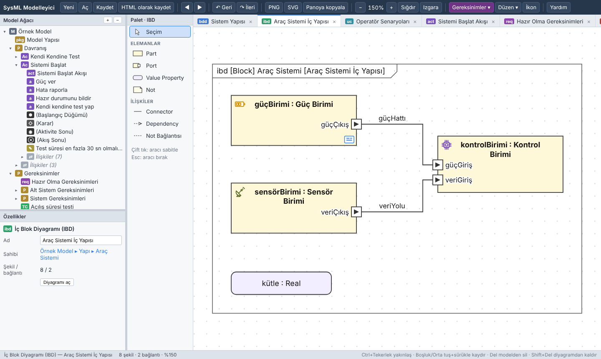 | 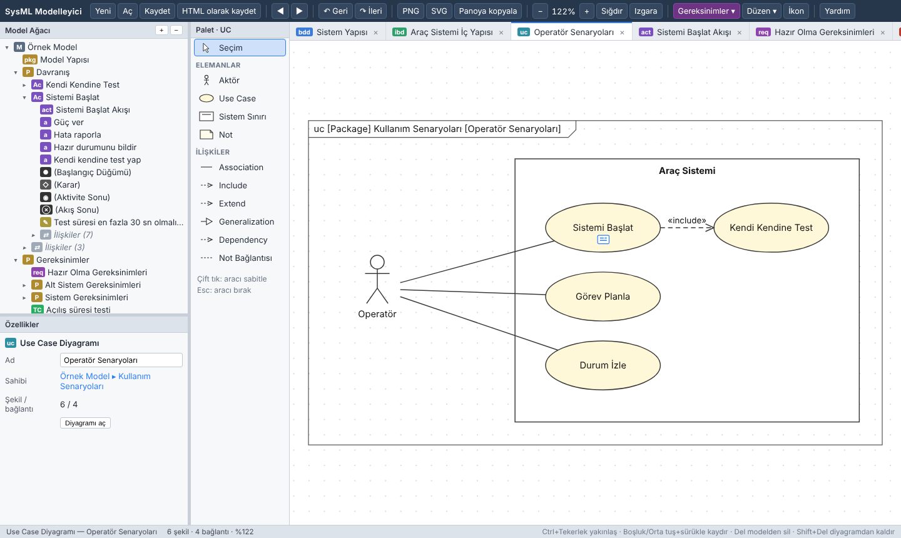 |

| Aktivite Diyagramı | İkon seçici |
|---|---|
| 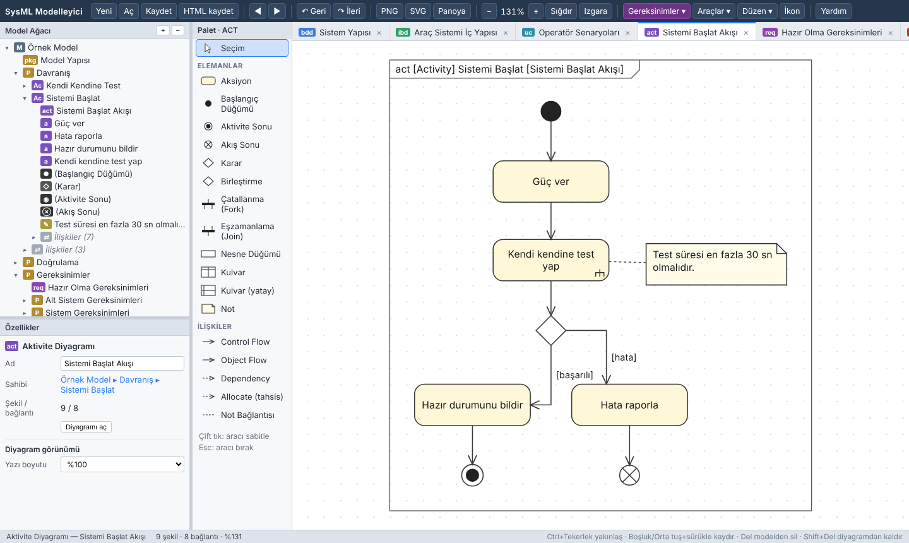 |  |

| Gereksinim Diyagramı | Durum Makinesi |
|---|---|
| 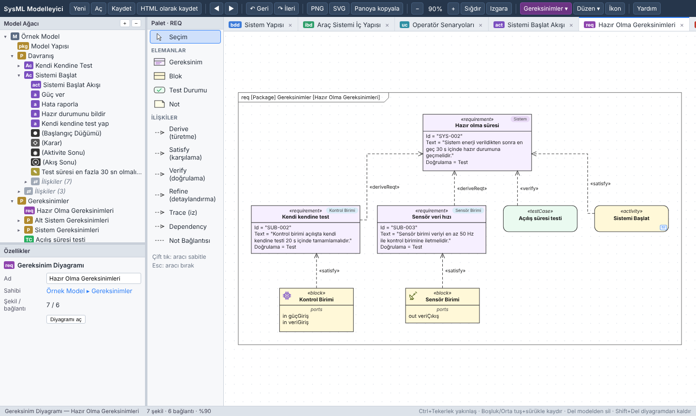 | 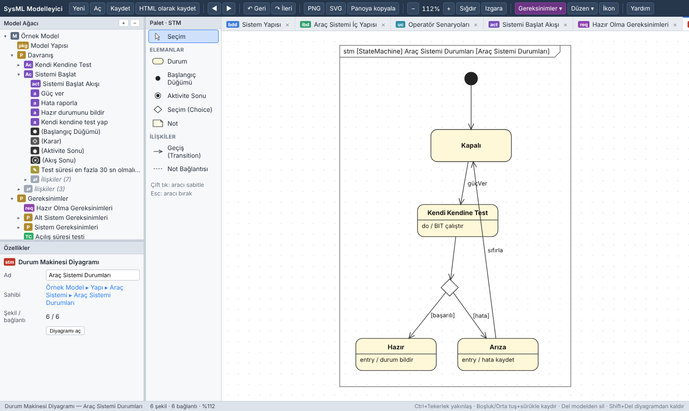 |

| Sıralama (Sequence) | Parametrik |
|---|---|
| 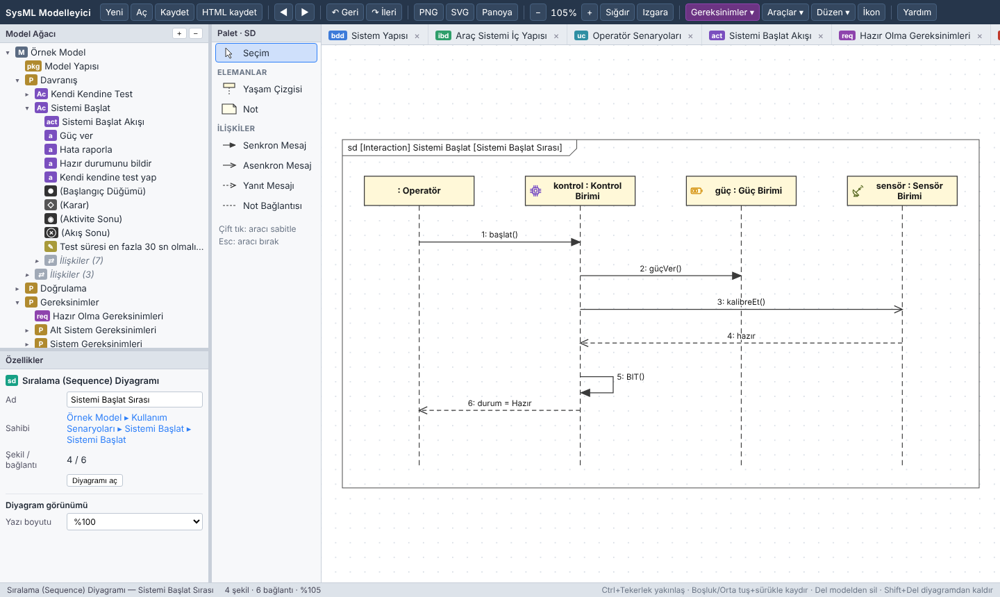 | 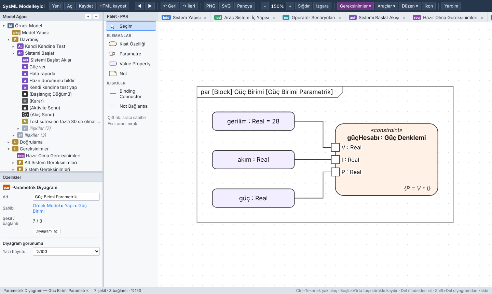 |

### Gereksinim yönetimi

| Gereksinim tablosu | İzlenebilirlik matrisi |
|---|---|
|  |  |

| Kapsama analizi | Excel'den içe aktarma |
|---|---|
|  |  |

| Doğrulama matrisi (VCRM) | Test kampanyası |
|---|---|
| 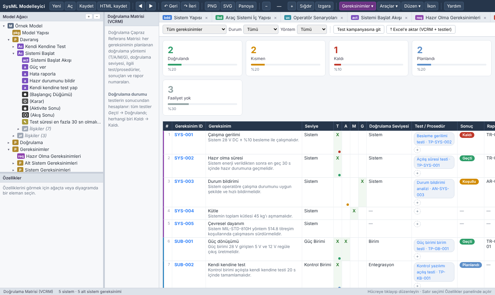 | 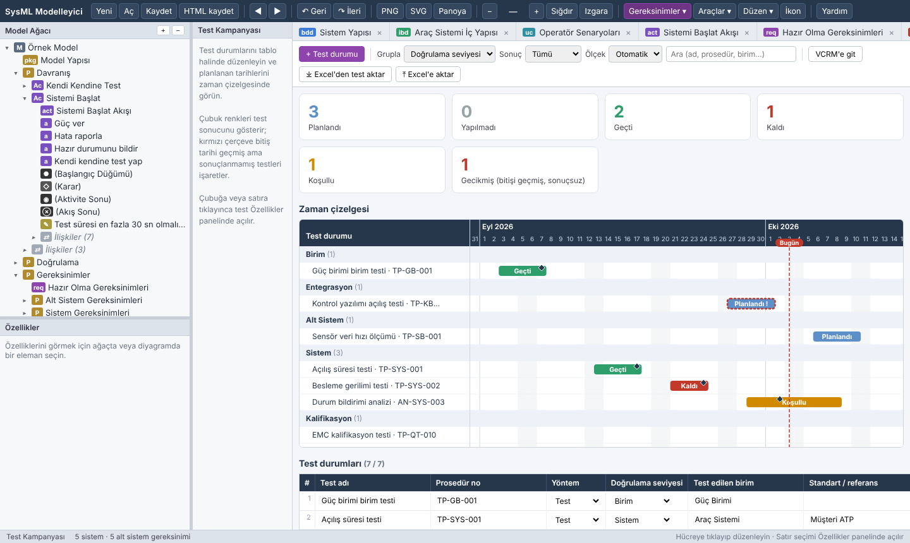 |

| Taban çizgisi karşılaştırma | Model doğrulama |
|---|---|
| 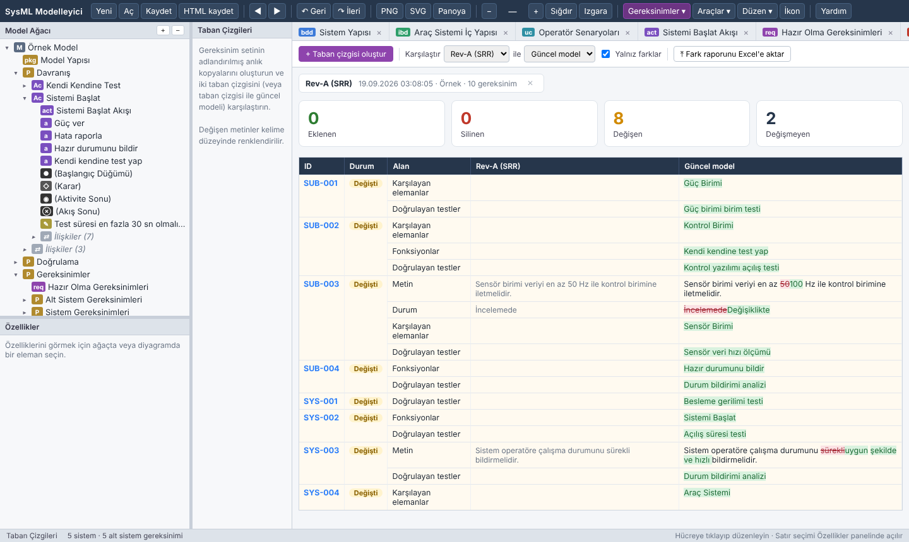 | 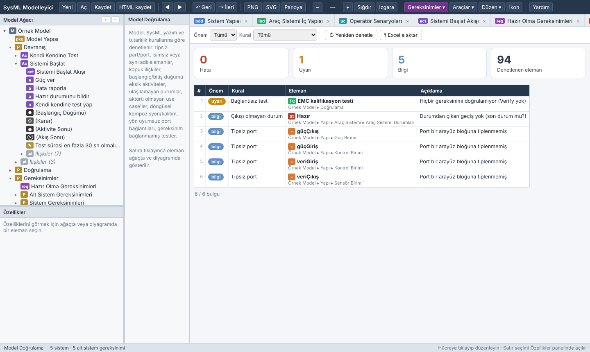 |

PNG çıktısı örneği:

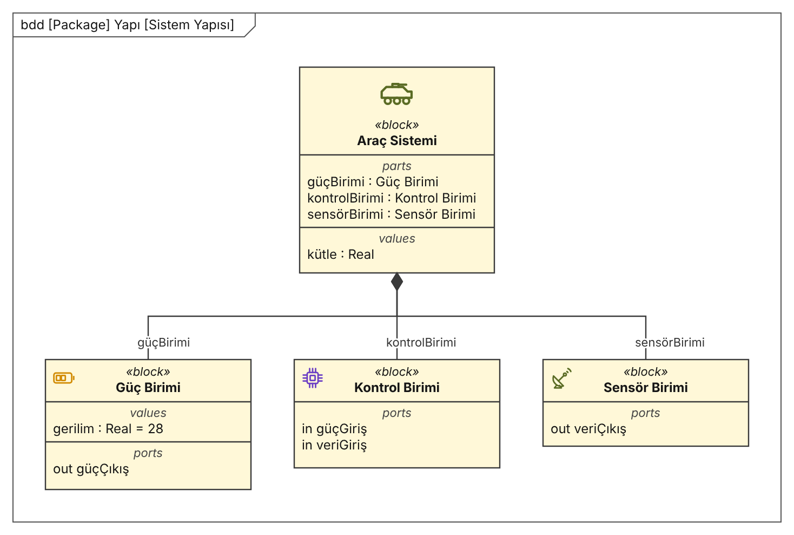

## Depo yapısı

```
app/sysml-modeler.html   Uygulamanın tamamı (tek dosya, bağımlılıksız HTML/JS/SVG)
desktop/                 Windows masaüstü sarmalayıcısı (Go + WebView2)
  main.go                Pencere, dosya diyalogları, otomatik kayıt
  build.bat / build.sh   exe derleme betikleri
docs/                    Kullanım kılavuzu ve ekran görüntüleri
tests/regression.js      Otomatik regresyon testi (başsız Chromium, Playwright)
assets/icon.png          Uygulama ikonu
```

Exe'yi kendiniz derlemek için: **[docs/GELISTIRME.md](docs/GELISTIRME.md)**

## Bilinen sınırlamalar

- Eski `.xls` biçimi okunmaz; Excel'de `.xlsx` olarak kaydedip aktarın.
- XMI alışverişi bir alt kümedir: model elemanları ve ilişkiler taşınır, Cameo diyagram yerleşimleri taşınmaz (içe aktarmada diyagramlar otomatik oluşturulur).
- Word raporundaki içindekiler tablosu Word açılışta alanları güncellediğinde dolar (Word sorarsa "Evet" deyin).
