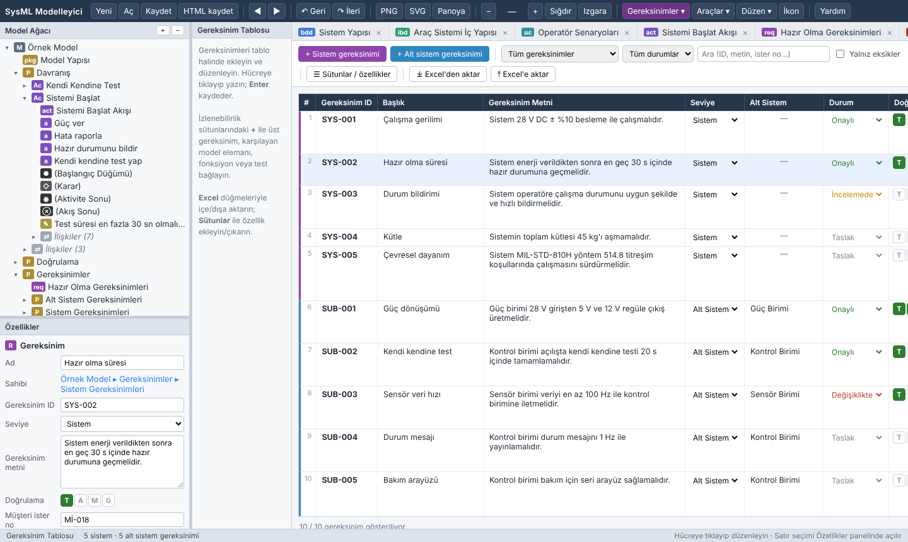
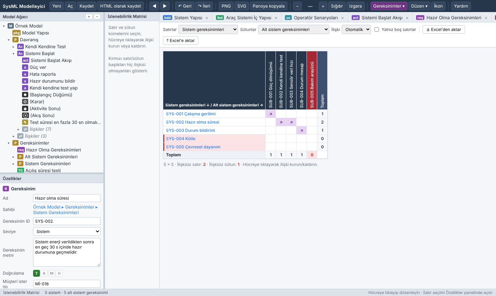
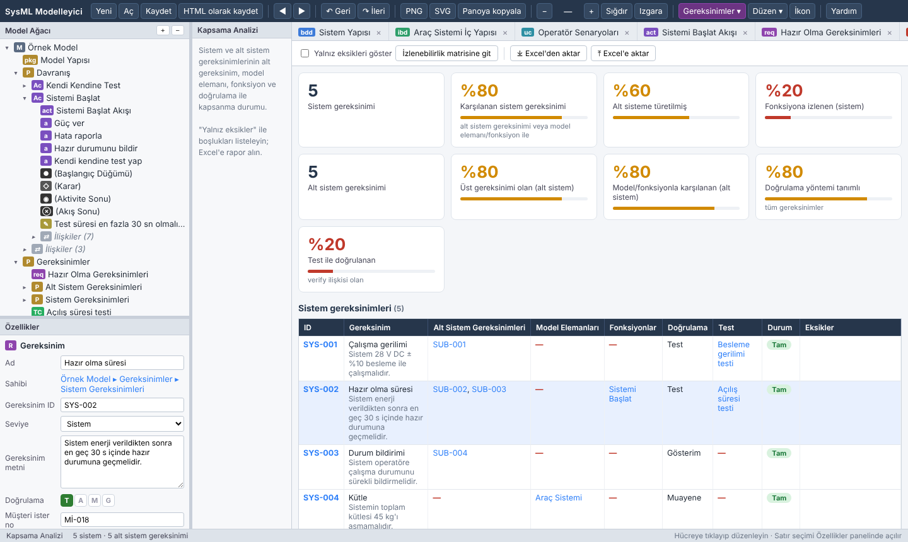
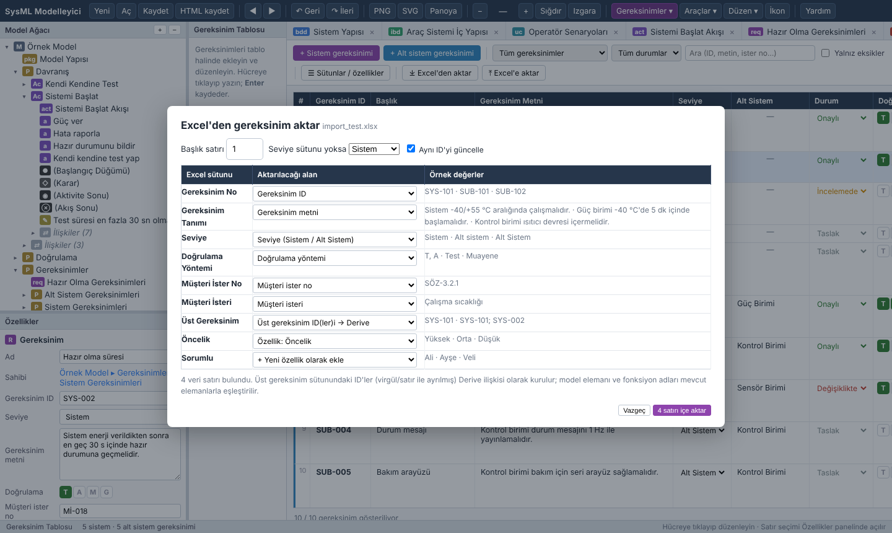
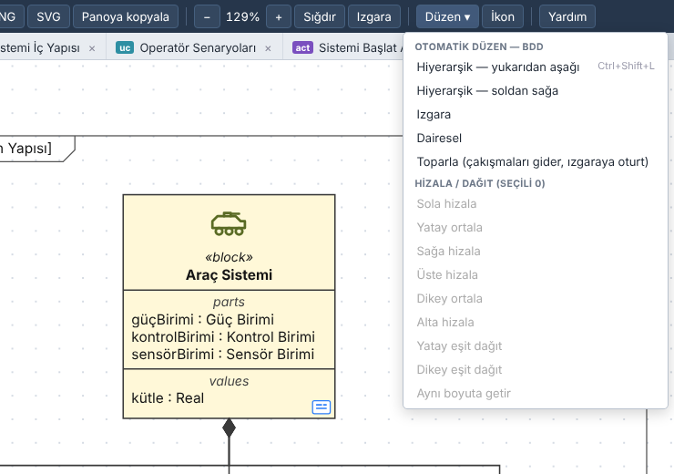
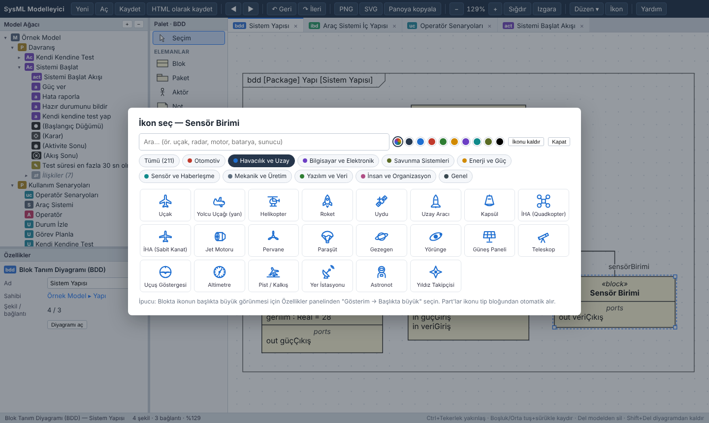
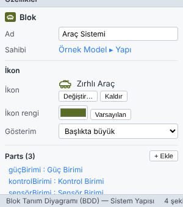

# Kullanım Kılavuzu

## İçindekiler

1. [Arayüz](#1-arayüz)
2. [Model ağacı](#2-model-ağacı)
3. [Diyagram oluşturma ve düzenleme](#3-diyagram-oluşturma-ve-düzenleme)
4. [Diyagram türleri](#4-diyagram-türleri)
5. [İç içe diyagramlar ve gezinme](#5-iç-içe-diyagramlar-ve-gezinme)
5a. [Gereksinim yönetimi ve izlenebilirlik](#5a-gereksinim-yönetimi-ve-izlenebilirlik)
5b. [Gereksinim kalitesi, durum, geçmiş ve taban çizgileri](#5b-gereksinim-kalitesi-durum-geçmiş-ve-taban-çizgileri)
5c. [Doğrulama ve test yönetimi](#5c-doğrulama-ve-test-yönetimi)
5d. [Araçlar: rapor, model doğrulama, birleştirme, ReqIF](#5d-araçlar-rapor-model-doğrulama-birleştirme-reqif)
5e. [Analiz: parametrik hesap, bütçe, simülasyon, tahsis, tablo, ilişki haritası](#5e-analiz-parametrik-hesap-bütçe-simülasyon-tahsis-tablo-ilişki-haritası)
5f. [XMI (Cameo / MagicDraw) ve şablonlar](#5f-xmi-cameo--magicdraw-ve-şablonlar)
5g. [Çevresel test profilleri](#5g-çevresel-test-profilleri)
5h. [FMEA / FMECA ve risk yönetimi](#5h-fmea--fmeca-ve-risk-yönetimi)
6. [Otomatik düzen ve hizalama](#6-otomatik-düzen-ve-hizalama)
7. [İkonlar](#7-ikonlar)
8. [Özellikler paneli](#8-özellikler-paneli)
9. [Kaydetme, açma ve paylaşma](#9-kaydetme-açma-ve-paylaşma)
10. [Görüntü olarak dışa aktarma](#10-görüntü-olarak-dışa-aktarma)
11. [Klavye kısayolları](#11-klavye-kısayolları)
12. [Sık sorulanlar](#12-sık-sorulanlar)

---

## 1. Arayüz

| Bölge | Görevi |
|---|---|
| **Araç çubuğu** (üst) | Yeni / Aç / Kaydet, gezinme (◀ ▶), geri al, **Dışa aktar ▾** (PNG/SVG/PDF/pano), yakınlaştırma, Izgara, **Harita**, **🖌 Biçim**, **Gereksinimler ▾**, **Analiz ▾**, **Araçlar ▾**, **Düzen ▾**, **İkon**, Yardım |
| **Model ağacı** (sol üst) | Modelin tamamı: paketler, bloklar, part'lar, aktörler, aktiviteler, diyagramlar, ilişkiler |
| **Özellikler** (sol alt) | Seçili elemanın adı, tipi, çokluğu, ikonu, açıklaması vb. |
| **Palet** | Açık diyagram türüne özel elemanlar ve ilişkiler |
| **Sekmeler + tuval** | Açık diyagramlar; çalışma alanı |
| **Durum çubuğu** (alt) | Diyagram bilgisi ve o anki araç için ipucu |

Paneller arasındaki ayırıcılar sürüklenerek boyutlandırılabilir.

## 2. Model ağacı

- **Sağ tık** menüsünde şunlar var:
  - Yeni eleman: Paket, Blok, Aktör, Use Case, Aktivite, Part, Value, Port…
  - Yeni diyagram
  - Yeniden adlandırma (`F2`)
  - Modelden silme (`Del`)
  - Açık diyagrama ekleme
- **Çift tık:**
  - Diyagramı açar.
  - Alt diyagramı olan bir elemanda o diyagrama gider.
  - Diğer elemanlarda dalı açar/kapatır.
- **Ağaç içinde sürükle:** Elemanı başka bir paket veya bloğun altına taşır.
- **Ağaçtan diyagrama sürükle:** Mevcut elemanı diyagramda gösterir; modelde var olan ilişkileri de otomatik çizilir.
  - IBD'ye bir **blok** bırakılırsa o tipte yeni bir *part* oluşur. Bir part'ın üzerine bırakılırsa o part'ın tipi değişir.
  - Aktivite diyagramına bir **aktivite** bırakılırsa onu çağıran bir aksiyon oluşur. Bir **blok** bırakılırsa nesne düğümü oluşur.
- İlişkiler, sahibi olan elemanın altında **İlişkiler (n)** grubunda listelenir.

## 3. Diyagram oluşturma ve düzenleme

- **Eleman ekleme:** Paletten tuvale sürükleyin ya da paletteki elemana tıklayıp tuvale tıklayın. Paletteki öğeye **çift tıklarsanız** araç sabitlenir ve art arda ekleme yapabilirsiniz; `Esc` ile bırakılır.
- **İlişki çizme:** Paletten ilişki türünü seçin, kaynak elemandan hedef elemana sürükleyin. Kurallara uymayan bağlantılar engellenir ve nedeni gösterilir.
- **Seçme:**
  - Tıklama: tek seçim
  - `Shift`/`Ctrl` + tıklama: çoklu seçim
  - Boş alanda sürükleme: alan seçimi
  - `Ctrl+A`: tümünü seçme
- **Taşıma:** Sürükleyin; ızgaraya oturur, `Alt` basılıyken ızgarasız taşınır. Ok tuşları 10 px (`Shift` ile 1 px) taşır.
- **Boyutlandırma:** Seçili şeklin köşe tutamaklarını sürükleyin.
- **Bağlantı rotası:**
  - Bağlantılar otomatik olarak elemanların etrafından dolaşır. Aynı kenara gelen bağlantılar ayrı noktalara dağıtılır, paralel hatlar üst üste binmez.
  - Düz çizgili bağlantılar (use case, durum makinesi, not bağlantısı) bir elemanı keserse dik açılı olarak etrafından dolaşır.
  - Elle ayar: seçili bağlantının ortasındaki mavi tutamak sürüklenir. Sağ tık → *Rotayı sıfırla* otomatik rotaya döndürür.
  - **Bükme noktaları:** Seçili bağlantının parçalarının ortasındaki turuncu yuvarlakları sürükleyerek bükme noktası ekleyin. Turuncu kare noktalar taşınır, çift tıklayınca silinir. *Düz* çizgide eğik (serbest açılı), *dik açılı* çizgide basamaklı çizilir. İki ucu birlikte taşınan bağlantının bükme noktaları da taşınır.
  - **Etiket taşıma:** Seçili bağlantının etiketini (ad, koşul, «stereotip», mesaj) sürükleyerek yerini değiştirin. Sağ tık → *Etiket konumunu sıfırla*.
  - Bağlantı ucunu yeniden bağlama: seçili bağlantının uç tutamacını başka bir elemana sürükleyin; model ilişkisi de güncellenir.
- **Kopyala / yapıştır:** `Ctrl+C` / `Ctrl+V`. Başka bir diyagrama yapıştırınca aynı model elemanları orada da gösterilir; aynı diyagrama yapıştırınca yeni eleman olarak kopyalanır (bloklar part, port ve değerleriyle). `Ctrl+Shift+V` her zaman yeni eleman olarak yapıştırır, `Ctrl+D` seçimi çoğaltır.
- **Ağaçtan toplu ekleme:** Ağaçta `Ctrl`/`Shift` + tık ile birden çok eleman seçip diyagrama birlikte sürükleyin; aralarındaki ilişkiler otomatik çizilir.
- **Arama:** `Ctrl+F` modeli ad, gereksinim ID ve metni, açıklama ve özellik değerlerinde arar; sonuca tıklayınca ağaçta ve diyagramda gösterilir.
- **Görünüm:** Özellikler panelindeki *Görünüm* bölümünden dolgu ve çizgi rengi, bloklarda bölmeleri (parts, references, values, ports) gizleme ve diyagram yazı boyutu ayarlanır. Aktivite diyagramında paletteki *Kulvar (yatay)* ile yatay kulvar eklenir.
- **Ad düzenleme:**
  - `F2` ya da `Alt`+çift tık ad düzenler.
  - Alt diyagramı olmayan elemanlarda düz çift tık da ad düzenler.
  - Notlarda düzenleme `Ctrl+Enter` ile bitirilir.
- **Silme:**
  - `Del`: elemanı **modelden** siler; tüm diyagramlardan kalkar.
  - `Shift+Del`: yalnızca **bu diyagramdan** kaldırır, eleman modelde kalır.
- **Biçim boyacısı (🖌 Biçim):** Bir şekil veya bağlantı seçip **Biçim**'e basın. Tıkladığınız diğer şekillere dolgu, çizgi rengi ve bölme görünümü, bağlantılara çizgi rengi ve rota türü uygulanır. Boş alana tıklayınca veya `Esc` ile çıkılır.
- **Lejant:** Her diyagram paletinde *Lejant* vardır. Öğeler her satıra `#renk açıklama` biçiminde yazılır (çizgi için `-#renk açıklama`). *Diyagramdaki renklerden doldur* düğmesi kullanılan dolgu, stereotip ve çizgi renklerini otomatik listeler.
- **Mini harita:** Diyagram ekrana sığmadığında sağ altta görünür. Tıklayarak veya sürükleyerek gezinilir. Araç çubuğundaki **Harita** ile açılıp kapatılır.
- **Yakınlaştırma:** `Ctrl` + fare tekerleği, araç çubuğundaki − / + ya da **Sığdır**.
- **Kaydırma:** Fare tekerleği, `Boşluk` + sürükleme veya orta tuşla sürükleme.

## 4. Diyagram türleri

### Blok Tanım Diyagramı (BDD)
**Elemanlar:** Blok, Arayüz Bloğu, Kısıt Bloğu, Değer Tipi, Numaralandırma, Sinyal, Paket, Aktör, Not
**İlişkiler:** Composition, Aggregation, Association, Generalization, Dependency, Not bağlantısı

- Bloklar *parts / references / values / ports* bölmelerini otomatik gösterir.
- **Composition** veya **Aggregation** çizildiğinde bütün blokta hedef blok tipinde bir *part* oluşur. Part adı hedef bloğun adından türetilir, sonradan değiştirilebilir.

### İç Blok Diyagramı (IBD)
**Elemanlar:** Part, Port, Value Property, Not
**İlişkiler:** Connector, Dependency, Not bağlantısı

- IBD bir bloğa aittir; açıldığında o bloğun part'ları, portları ve connector'ları otomatik yerleşir.
- **Port** bir part'ın üzerine bırakılınca kenarına oturur ve part'ın tipi olan bloğa eklenir; dolayısıyla BDD'de de görünür.
- Port yönü (in / out / inout) Özellikler panelinden seçilir ve port üzerinde ok olarak gösterilir.
- Part'a sağ tık → **Portları göster**: tip bloğun portlarını yerleştirir.

### Use Case Diyagramı
**Elemanlar:** Aktör, Use Case, Sistem Sınırı, Not
**İlişkiler:** Association, Include, Extend, Generalization, Dependency, Not bağlantısı

### Aktivite Diyagramı
**Elemanlar:** Aksiyon, Sinyal Gönder, Olay Kabul, Zaman Olayı, Pin, Aktivite Parametresi, Başlangıç, Aktivite Sonu, Akış Sonu, Karar, Birleştirme, Fork, Join, Nesne Düğümü, Kulvar, Kesilebilir Bölge, Not
**İlişkiler:** Control Flow, Object Flow, Dependency, Not bağlantısı

- Karar düğümünden çıkan akışa çift tıklanınca **koşul** (guard) yazılır, ör. `[başarılı]`.
- Bir aksiyon bir aktiviteyi **çağırabilir**. Çağrı Özellikler panelindeki *Çağırır* alanından kurulur ve aksiyonun sağ altında SysML "tırmık" simgesiyle gösterilir.

### Gereksinim Diyagramı (req)
**Elemanlar:** Gereksinim, Blok, Test Durumu, Not (ağaçtan aktivite, aksiyon, use case, part da bırakılabilir)
**İlişkiler:** Derive (türetilen → kaynak), Satisfy (model elemanı → gereksinim), Verify (test → gereksinim), Refine, Trace, Dependency

- Gereksinim kutusu `Id`, `Text` ve doğrulama yöntemini gösterir; sağ üstteki etiket seviyeyi (Sistem / Alt sistem) belirtir.
- Diyagramda çizilen her ilişki gereksinim tablosuna, matrise ve kapsama analizine anında yansır. Tersi de geçerlidir: tabloda kurulan bir ilişki, iki eleman da diyagramdaysa bağlantı olarak çizilebilir (sağ tık → *İlişkili elemanları göster*).

### Durum Makinesi Diyagramı (stm)
**Elemanlar:** Durum, Bölge, Başlangıç, Son durum, Seçim (choice), Kavşak (junction), Geçmiş (history), Not
**İlişki:** Geçiş (Transition)

- Durumların Özellikler panelinden `entry /`, `do /`, `exit /` davranışları yazılır.
- Geçiş etiketi `tetik [koşul] / etki` biçimindedir: *Ad* alanı tetik, *Koşul* ve *Etki* ayrı alanlardır. Bir durum kendisine de geçiş yapabilir.
- Durum makinesi bir bloğa aittir: bloğa sağ tık → *Yeni alt diyagram* veya ağaçta *Yeni diyagram → Durum Makinesi*.

### Sıralama (Sequence) Diyagramı (sd)
**Elemanlar:** Yaşam çizgisi, Birleşik parça (fragment), Not
**İlişkiler:** Senkron mesaj (dolu ok), Asenkron mesaj (açık ok), Yanıt mesajı (kesikli)

- Ağaçtan bir **blok, aktör veya part** bırakmak o tipte yaşam çizgisi oluşturur.
- Mesaj, kaynak yaşam çizgisinden hedefe sürüklenerek çizilir; bıraktığınız yükseklikte yer alır. Aynı yaşam çizgisine bırakmak kendine mesaj (self message) oluşturur.
- Seçili mesajın mavi tutamağı yukarı/aşağı sürüklenerek sıra değiştirilir; numaralar otomatik güncellenir.
- *Düzen → Sıralı yerleşim* yaşam çizgilerini yan yana dizer, mesajları eşit aralıklar.

### Parametrik Diyagram (par)
**Elemanlar:** Kısıt özelliği, Parametre, Value property, Not
**İlişki:** Binding connector

- Önce BDD paletinden bir **Kısıt Bloğu** oluşturun; Özellikler panelinden ifadesini (ör. `P = V * I`) ve parametrelerini girin.
- Kısıt bloğunu ağaçtan parametrik diyagrama bırakmak, parametreleri kenarına dizilmiş bir kısıt özelliği oluşturur.
- Bloğun value property'lerini parametrelere binding connector ile bağlayın.

### Paket Diyagramı (pkg)
**Elemanlar:** Paket, Blok, Arayüz Bloğu, Değer Tipi, Stereotip, Gereksinim, Not
**İlişkiler:** Dependency, Import

Paket şekilleri içerdikleri elemanları (türleriyle birlikte) listeler.

### Arayüzler, değer tipleri ve stereotipler (v1.7)

**Arayüz bloğu (InterfaceBlock):** BDD paletindedir. *Flow properties* bölmesinde akış özellikleri (`in`/`out`/`inout`, tip, çokluk) tanımlanır.

- Bir port'un tipi arayüz bloğu yapıldığında port yönü boş bırakılırsa akış özelliklerinden türetilir.
- Port'ta **Eşlenik (~)** işaretlenirse yönler ters çevrilir ve etiket `~GüçArayüzü` olarak gösterilir. Böylece aynı arayüz iki uçta da kullanılır.
- Port türü (standart / proxy / full) Özellikler panelinden seçilir.

**Değer tipi (ValueType), numaralandırma (Enumeration), sinyal (Signal):**

- Değer tipinde temel tip, birim ve büyüklük türü (quantity kind) girilir.
- Value property'nin *Tip* listesi modeldeki değer tiplerini ve numaralandırmaları önerir. Birim boşsa değer tipinin birimi kullanılır.
- **Araçlar ▾ → Birim / değer tipi kütüphanesini ekle (SI)** kütle, frekans, ivme (g), PSD (g²/Hz), ses basınç seviyesi (dB), sıcaklık, gerilim gibi 22 tipi "Birimler" paketine ekler.
- Numaralandırmanın değerleri her satıra bir tane yazılır.
- Sinyallerin öznitelikleri value property olarak eklenir.

**Stereotipler:** Kendi profilinizi oluşturmanızı sağlar (ör. «LRU», «COTS», «yazılımBileşeni»).

1. Herhangi bir elemanı seçin, Özellikler panelinde **Stereotipler → + Yeni**'ye basın. "Profil" paketinde, bu eleman türüne uygulanabilen yeni bir stereotip oluşur ve elemana uygulanır.
2. Stereotipi seçip **Etiketler** alanına her satıra bir etiket yazın: `ad : tip = varsayılan` (ör. `MTBF : Real = 10000`). Tip `Boolean` ise onay kutusu, bir numaralandırma adıysa açılır liste olarak sorulur.
3. **Uygulanır** listesinden hangi eleman türlerine uygulanabileceğini seçin; isteğe bağlı **dolgu rengi** verin.
4. Elemanlarda etiket değerlerini doldurun. Değerler blokta *tags* bölmesinde, stereotip adı başlıkta `«block, LRU»` olarak görünür.

### Aktivite: pin, parametre, sinyal ve kesme (v1.7)

- **Pin:** Paletten aksiyonun üzerine bırakın. Üst yarıya bırakılan pin `in`, alt yarıya bırakılan `out` olur. Object flow pinler arasında çizilir.
- **Aktivite parametresi:** Aktiviteye giriş/çıkış parametresi ekler. Bu aktiviteyi çağıran aksiyonlarda pinler parametrelerden otomatik oluşur.
- **Sinyal Gönder / Olay Kabul:** Özellikler panelinden sinyali seçin. Ağaçtan bir sinyali aktivite diyagramına bırakmak *Sinyal Gönder* aksiyonu oluşturur.
- **Zaman olayı:** Kum saati simgesidir; adına `after (5 s)` gibi zaman ifadesini yazın.
- **Kesilebilir bölge** kesikli çerçevedir. Bölgeden çıkan akışta Özellikler → *Kesme akışı* işaretlenince akış üzerinde şimşek simgesi görünür.
- Aksiyon farklı adlı bir aktiviteyi çağırıyorsa etiket `aksiyon : Aktivite` biçiminde gösterilir.

### Sıralama: fragmentler ve yürütme çubukları (v1.7)

- **Birleşik parça (fragment):** Paletten diyagrama yerleştirin. Özelliklerden operatörü seçin: `alt`, `opt`, `loop`, `par`, `break`, `critical`, `seq`, `strict`, `neg`, `ref`…
- *Operandlar* alanına her satıra bir operandın koşulunu yazın (ör. `sıcaklık > 70` / `else`). Operand ayırıcılarını seçili fragmentteki mavi tutamaklarla yukarı/aşağı taşıyın.
- Fragment taşınınca içindeki mesajlar da birlikte taşınır. *Sıralı yerleşim* düzeni fragmentleri kapsadıkları mesajlara göre yeniden boyutlandırır.
- `ref` fragmenti başka bir etkileşime başvurur: *Bağlı diyagram* alanından seçin, çift tıklayınca açılır.
- **Yürütme çubukları** senkron mesajın hedefinde açılır, aynı yaşam çizgisinden dönen yanıtla kapanır. Diyagram özelliklerinden kapatılabilir.

### Durum makinesi: bileşik durum, bölge, geçmiş (v1.7)

- Bir durumu büyütüp içine başka durumlar, başlangıç ve **Geçmiş (H / H\*)** düğümleri sürükleyin. Durum bileşik görünüme geçer (ad üstte, ayırıcı çizgi). Model ağacında iç durumlar da o durumun altına taşınır; dışarı sürüklenince geri çıkar.
- **Bölge (region)** paralel (ortogonal) bölgeler için kullanılır.
- **Kavşak (junction)** ve **seçim (choice)** sözde durumları geçişlerde kullanılabilir.
- İki durum arasındaki karşılıklı geçişler artık üst üste binmez, etiketleri iki yana yerleşir.
- Model doğrulama bileşik durumları dikkate alır: bileşik duruma giriş, içindeki başlangıçtan iç durumlara ulaşır sayılır.

## 5. İç içe diyagramlar ve gezinme

Bir elemana **çift tıklandığında**, elemanın bir alt diyagramı varsa o açılır:

| Eleman | Açılan diyagram |
|---|---|
| Blok | Bloğun IBD'si (veya sahip olduğu diğer diyagramlar) |
| Part / Nesne düğümü | Tip bloğunun diyagramı |
| Aksiyon | Çağırdığı aktivitenin diyagramı |
| Use Case | Bağlı akış (aktivite) diyagramı |
| Paket | İçindeki diyagramlar |
| Herhangi bir eleman | **Bağlı diyagram** (hiperlink) olarak seçilmiş diyagram |

- Birden fazla aday varsa seçim menüsü çıkar.
- Alt diyagramı olan şekillerin sağ alt köşesinde küçük mavi bir **diyagram simgesi** görünür. Bu simge görüntü çıktısına girmez.
- **Yeni alt diyagram:** Şekle sağ tık → *Yeni alt diyagram*. Örneğin bir aksiyon için yeni aktivite oluşturur, aksiyonun onu çağırmasını sağlar ve diyagramını açar.
- **Bağlı diyagram:** Herhangi bir elemana Özellikler panelinden veya sağ tık → *Diyagram bağla* ile bir diyagram bağlanabilir.
- **Gezinme:** Araç çubuğunda ◀ ▶, `Alt+←` / `Alt+→` ya da farenin geri/ileri tuşları.

## 5a. Gereksinim yönetimi ve izlenebilirlik

Araç çubuğundaki **Gereksinimler ▾** menüsü üç görünüm açar. Bunlar diyagram sekmeleri gibi sekmede açılır ve modelle canlı bağlıdır.

### Gereksinim tablosu

- **+ Sistem gereksinimi / + Alt sistem gereksinimi:**
  - Yeni satır ekler; ID otomatik verilir (varsayılan `SYS-001`, `SUB-001`).
  - Alt sistem gereksinimi eklerken **alt sistem adı** sorulur. Mevcut alt sistemlerden birine tıklayın ya da yeni bir ad yazın; listede modeldeki blok adları da önerilir.
  - Gereksinimler ağaçta *Gereksinimler → Sistem Gereksinimleri* ve *Gereksinimler → Alt Sistem Gereksinimleri → <alt sistem adı>* paketlerine yerleşir. Alt sistem adı değişince gereksinim ilgili pakete taşınır.
- **Alt sistem adı:** Tablodaki *Alt Sistem* sütunundan veya Özellikler panelinden değiştirilir. Bir sistem gereksinimini *Alt Sistem* seviyesine almak da adı sorar.
- **Düzenleme:**
  - Hücreye tıklayıp yazın. `Enter` kaydeder ve alt satıra geçer, `Shift+Enter` satır içinde yeni satır açar, `Esc` vazgeçer.
  - Seviye açılır listeden değiştirilir; değişince ID'yi yeniden numaralandırmayı sorar.
- **Doğrulama yöntemi:** **T** (Test), **A** (Analiz), **M** (Muayene), **G** (Gösterim) düğmeleri aç/kapa çalışır; birden fazlası seçilebilir.
- **İzlenebilirlik sütunları** (mor başlıklı):
  - Türetildiği sistem gereksinimi
  - Alt sistem gereksinimleri
  - Karşılayan model elemanları
  - Fonksiyonlar
  - Doğrulayan test
  - Kapsama durumu

  Her hücredeki **+** düğmesi arama yapılabilen bir seçim penceresi açar. İşaretleyip *Uygula* deyince ilişkiler kurulur, işareti kaldırınca silinir.
  - Test seçiminde *+ Yeni test durumu* ile doğrudan test oluşturulabilir.
- **Filtreler:**
  - Seviye listesi: *Tüm gereksinimler*, *Sistem gereksinimleri*, *Tüm alt sistemler* ve her alt sistem adıyla ayrı seçenek (ör. *Alt sistem: Kontrol Birimi*). Adı girilmemiş alt sistem gereksinimleri için de ayrı seçenek çıkar.
  - Arama (ID, metin, ister no, özellik değerleri) ve *Yalnız eksikler*.
  - Başlığa tıklamak sütuna göre sıralar.
- **Özellikler paneli:** Satıra tıklanınca gereksinimin tüm alanları ve izlenebilirliği Özellikler panelinde de açılır.

#### Sütunlar ve özel özellikler

**☰ Sütunlar / özellikler** penceresinden:
- Sütunları gizleyin veya gösterin (gizli sütunlar Excel'e aktarılmaz).
- **Yeni özellik** ekleyin (ör. *Öncelik, Durum, Sorumlu, Alt sistem, Kaynak doküman*). Her gereksinimde ayrı alan olarak tutulur, tabloda ve Excel'de sütun olur.
- Özellikleri yeniden adlandırın veya silin (silinince tüm değerleri de silinir).
- Sistem ve alt sistem **ID öneklerini** ve hane sayısını ayarlayın.

### İlişki türleri

| İlişki | Yön | Anlamı |
|---|---|---|
| **Derive** (deriveReqt) | alt sistem gereksinimi → sistem gereksinimi | Alt gereksinim, üst gereksinimden türetilmiştir |
| **Satisfy** | model elemanı / fonksiyon → gereksinim | Blok, part, use case… veya aktivite/aksiyon (fonksiyon) gereksinimi karşılar |
| **Verify** | test durumu → gereksinim | Test, gereksinimi doğrular |
| Refine / Trace | herhangi ↔ gereksinim | Detaylandırma / genel iz |
| Allocate | fonksiyon → blok/part | Fonksiyonun yapıya tahsisi (BDD ve aktivite paletinde) |

**Fonksiyon izlenebilirliği:**
- Aktiviteler ve aksiyonlar *fonksiyon* olarak kabul edilir. Bir gereksinimi karşılayan fonksiyonlar tabloda ayrı sütunda, matriste *Fonksiyonlar* kümesinde ve kapsama analizinde ayrı göstergede izlenir.
- Fonksiyonun hangi bloğa tahsis edildiği **Allocate** ile modellenir.

### İzlenebilirlik matrisi

- **Satırlar:** sistem / alt sistem / tüm gereksinimler veya tek bir alt sistemin gereksinimleri.
- **Sütunlar:** alt sistem veya sistem gereksinimleri, tek bir alt sistem, fonksiyonlar, bloklar, tüm model elemanları, test durumları, use case'ler.
- **İlişki türü:** *Otomatik* seçiliyken gereksinim × gereksinim için **Derive**, test için **Verify**, diğerleri için **Satisfy** kullanılır. İsterseniz türü elle seçin.
- **Hücreye tıklamak** ilişkiyi kurar veya kaldırır (`Ctrl+Z` ile geri alınır).
- **Kırmızı satır/sütun başlığı:** Hiç ilişkisi olmayan eleman. *Yalnız boş satırlar* yalnızca bunları gösterir.

### Kapsama analizi

**Göstergeler:**
- Karşılanan sistem gereksinimi yüzdesi
- Alt sisteme türetilmiş yüzde
- Fonksiyona izlenen yüzde
- Üst gereksinimi olan alt sistem gereksinimi yüzdesi
- Model veya fonksiyonla karşılanan yüzde
- Doğrulama yöntemi tanımlı yüzde
- Test ile doğrulanan yüzde

**Durum kuralları:**

| Seviye | Eksik | Kısmi | Tam |
|---|---|---|---|
| Sistem | Ne alt sistem gereksinimine türetilmiş ne de bir model elemanı/fonksiyon tarafından karşılanıyor | Karşılanıyor ama doğrulama yöntemi yok | Karşılanıyor ve doğrulama yöntemi var |
| Alt sistem | Hiçbir model elemanı/fonksiyon karşılamıyor | Karşılanıyor ama üst gereksinimi yok (**yetim**) veya doğrulama yöntemi yok | Hepsi tamam |

- Her satırın **Eksikler** sütunu neyin eksik olduğunu yazar. *Yalnız eksikleri göster* ile yalnızca boşluklar listelenir.
- Sayfanın sonunda **hiçbir gereksinime izlenmeyen bloklar ve fonksiyonlar** (gereksiz/fazladan tasarım adayları) listelenir.

### Excel'den içe aktarma

1. **⤓ Excel'den aktar** ile `.xlsx` veya `.csv` dosyası seçin (CSV'de `;`, `,` veya sekme ayracı ve Türkçe Windows kodlaması otomatik tanınır).
2. Birden fazla sayfa varsa sayfayı, gerekirse başlık satırını seçin.
3. Her Excel sütunu için aktarılacağı alanı kontrol edin. Başlıklar otomatik eşleşir; örneğin *"Gereksinim No"* → ID, *"Müşteri İster No"* → müşteri ister no, *"Üst Gereksinim"* → Derive. Eşleşmeyen sütunlar **yeni özellik** olarak eklenir; istemediğiniz sütunu *Yok say* yapın.
4. Dosyada seviye sütunu yoksa varsayılan seviyeyi seçin. Seviye değerinde *alt/sub/birim* geçiyorsa **Alt Sistem** sayılır. *Alt Sistem* / *Birim* / *Subsystem* başlıklı sütun alt sistem adı olarak aktarılır; alt sistem adı dolu olan satırlar seviye belirtilmemişse alt sistem gereksinimi sayılır.
5. *Aynı ID'yi güncelle* işaretliyse mevcut gereksinimler güncellenir, yeniler eklenir.

İlişki sütunları:
- **Üst gereksinim ID'leri** (virgül, noktalı virgül veya satır ile ayrılmış) Derive ilişkisi olarak kurulur.
- **Karşılayan model elemanı** ve **fonksiyon** sütunlarındaki adlar mevcut elemanlarla eşleştirilip Satisfy kurulur.
- **Doğrulayan test** adları test durumu olarak oluşturulur ve Verify kurulur.
- Bulunamayan adlar işlem sonunda bildirilir.

Doğrulama yöntemi metinleri (*T, A, Test, Analiz, Muayene, Inspection, Gösterim, Demo…*) standart değerlere çevrilir.

### Dışa aktarma ve sütun (attribute) seçimi

**Gereksinimler ▾ → Excel'e aktar… / Word'e aktar… / ReqIF olarak dışa aktar…** (ve tablodaki **⤒ Excel'e aktar**) önce bir seçim penceresi açar:

- **Sütunlar:** çıktıya girecek attribute'ları işaretleyin (standart alanlar, özel özellikler, izlenebilirlik sütunları ve *Açıklama, Paket, Son Değişiklik* gibi ek alanlar). Sırayı ▲▼ ile değiştirin. **Tablodaki görünür sütunlar** düğmesi, tabloda gördüğünüz sütunları seçer.
- **Kapsam:** tüm gereksinimler, yalnız sistem, tüm alt sistemler veya tek bir alt sistem; isterseniz iptal edilenler hariç.
- **Excel'de ek sayfalar:** izlenebilirlik matrisleri, kapsama analizi, kalite bulguları, VCRM ve test durumları ayrı ayrı açılıp kapatılır.
- **Word:** seçilen sütunlarla, sistem ve alt sistemlere göre gruplanmış bir *Gereksinim Spesifikasyonu* (.docx) üretilir; çok sütunda yatay sayfa önerilir. **Araçlar ▾ → Rapor oluştur** içindeki gereksinim tablosu da aynı seçimi kullanır.
- **ReqIF:** ID ve metin her zaman aktarılır; diğer attribute'lar seçime göre eklenir.

Seçim modelle birlikte kaydedilir; bir sonraki dışa aktarmada aynı sütunlar hazır gelir.

Excel çıktısı tek bir `.xlsx` dosyasıdır:

| Sayfa | İçerik |
|---|---|
| Gereksinimler | Seçilen sütunlar (özel özellikler ve izlenebilirlik dahil), filtreli başlık, renkli kapsama durumu |
| Sistem-Alt Sistem | Sistem × alt sistem türetme matrisi (X) |
| Gereksinim-Fonksiyon | Gereksinim × fonksiyon karşılama matrisi |
| Gereksinim-Blok | Gereksinim × blok karşılama matrisi |
| Kapsama Analizi | Gösterge özetleri, her gereksinimin kapsama durumu, eksikleri ve doğrulama durumu |
| Kalite | Kalite denetimi bulguları (önem, bulgu) |
| VCRM | Doğrulama çapraz referans matrisi |
| Test Durumları | Tüm test alanları ve doğruladığı gereksinimler |

Dışa aktarılan dosya tekrar içe aktarılabilir. Ortak ID'ler güncellenir ve ilişkiler korunur; Excel'de toplu düzenleme yapıp geri almak için kullanılabilir.

## 5b. Gereksinim kalitesi, durum, geçmiş ve taban çizgileri

### Durum iş akışı

Her gereksinimin bir **durumu** vardır: *Taslak → İncelemede → Onaylı → Değişiklikte → İptal*. Tabloda **Durum** sütunundan veya Özellikler panelinden değiştirilir; tablo duruma göre filtrelenebilir.

- **Onaylı** bir gereksinimin başlığı, metni, doğrulama yöntemi, seviyesi veya alt sistemi değişirse durum otomatik olarak **Değişiklikte** olur.
- **İptal** edilen gereksinimler kapsama analizine, VCRM'e ve kalite raporuna girmez.

### Kalite denetimi

Gereksinim metinleri INCOSE yazım kurallarına göre otomatik denetlenir. Tablodaki **Kalite** sütununda rozet, Özellikler panelinde uyarı listesi görünür; tüm bulgular **Gereksinimler ▾ → Kalite raporu** görünümündedir.

Kalite raporu çubuğundaki **Yazım kuralı** seçimi modelle kaydedilir: *"-ecek / -acak / -ecektir / -acaktır" ile biter* (varsayılan), *"-malıdır / -melidir" ile biter* veya *ikisi de kabul edilir*.

| Kural | Örnek |
|---|---|
| Cümle sonu | Türkçe gereksinim cümlesi **"-ecek / -acak / -ecektir / -acaktır"** ile bitmelidir (ör. *"…28 V ile çalışacaktır."*, *"…45 kg'ı aşmayacaktır."*). "-malıdır / -melidir" ile biten cümle için doğru biçim önerilir (*çalışmalıdır → çalışacaktır*). Sondaki parantez içi açıklamalar (*bkz. Tablo 3*) dikkate alınmaz; İngilizce *shall* de kabul edilir. |
| Birden fazla ister | Birden fazla cümle ya da "ve / veya" ile bağlanmış birden çok zorunluluk fiili (*"…kaydedecek ve iletecektir."*) |
| Belirsiz ifade | uygun, yeterli, hızlı, kolay, kullanıcı dostu, vb., ve/veya… |
| Belirlenmemiş değer | TBD, TBC, belirlenecek |
| Birimsiz sayı | "30 ağırlıkta" (yüzde ve standart/yöntem numaraları hariç) |
| Aşırı uzun metin | Bölünmesi önerilir |
| Yinelenen ID / çok benzer gereksinim | Aynı ID veya metni %72'den fazla örtüşen gereksinimler |

### Değişiklik geçmişi

Gereksinim alanlarındaki ve üst gereksinim bağlantılarındaki her değişiklik **kim, ne zaman, eski → yeni değer** olarak kaydedilir. Özellikler panelindeki **Gerekçe** alanına yazdığınız metin (ör. *ECR-012*) sonraki değişikliklere eklenir. Metin değişiklikleri kelime düzeyinde renkli gösterilir. Tüm geçmiş: **Gereksinimler ▾ → Değişiklik geçmişi** (Excel'e aktarılabilir). Kullanıcı adınızı **Gereksinimler ▾ → Kullanıcı adım** ile ayarlayın.

### Taban çizgileri (baseline)

**Gereksinimler ▾ → Taban çizgileri** görünümünde **+ Taban çizgisi oluştur** ile gereksinim setini adla dondurun (ör. *Rev-A (SRR)*). İki taban çizgisini veya bir taban çizgisini güncel modelle karşılaştırın: eklenen, silinen ve değişen gereksinimler alan alan listelenir. Fark raporu Excel'e aktarılabilir.

### Etki analizi

Bir gereksinime veya model elemanına sağ tıklayıp (ya da Özellikler → **⇶ Etki analizi**) değişikliğin etkileyeceği alt/üst gereksinimleri, karşılayan elemanları, testleri ve diyagramları ağaç halinde görün.

## 5c. Doğrulama ve test yönetimi

### Test durumu alanları

Test durumu (TestCase) seçildiğinde Özellikler panelinde şu alanlar bulunur: prosedür no, yöntem (Test / Analiz / Muayene / Gösterim), doğrulama seviyesi (Birim, Entegrasyon, Alt Sistem, Sistem, Kabul (FAT), Saha (SAT), Kalifikasyon), test edilen birim, standart/referans, sorumlu, planlanan başlangıç ve bitiş, sonuç (*Planlandı, Yapılmadı, Geçti, Kaldı, Koşullu*), sonuç tarihi ve rapor no. Sonuç girildiğinde sonuç tarihi boşsa bugün atanır. Gereksinim diyagramında test şeklinin köşesinde sonuç rozeti görünür.

### Doğrulama durumu

Her gereksinimin doğrulama durumu, Verify ile bağlı testlerin sonucundan hesaplanır:

| Durum | Koşul |
|---|---|
| Doğrulandı | Tüm testler *Geçti* |
| Kaldı | En az bir test *Kaldı* |
| Kısmen | Bazı testler *Geçti* veya *Koşullu* |
| Planlandı | Testler var, henüz sonuç yok |
| Faaliyet yok | Bağlı test yok |

Bu durum gereksinim tablosunda (**Doğrulama Durumu** sütunu), kapsama analizinde ve Excel çıktısında görünür.

### VCRM (Doğrulama Çapraz Referans Matrisi)

**Gereksinimler ▾ → Doğrulama matrisi (VCRM)**: her gereksinim için planlanan yöntemler (T/A/M/G hücrelerine tıklayarak değiştirilir; renkli nokta o yöntemdeki testlerin sonucudur), doğrulama seviyesi, test/prosedürler, sonuçlar, rapor numaraları ve doğrulama durumu. Seviye/alt sistem, durum ve yöntem filtreleri vardır.

### Test kampanyası

**Gereksinimler ▾ → Test kampanyası** görünümü:

- Üstte sonuç sayaçları ve gecikmiş test sayısı.
- **Zaman çizelgesi (Gantt):** testler planlanan tarihlerine göre çubuk olarak; renk sonucu gösterir, kırmızı kesikli çerçeve bitişi geçmiş ama sonuçlanmamış testleri işaretler, ◆ sonuç tarihidir, kırmızı çizgi bugündür. Doğrulama seviyesi, sonuç, yöntem, birim veya sorumluya göre gruplanır; ölçek gün/hafta/ay seçilebilir.
- **Test tablosu:** tüm alanlar doğrudan düzenlenir; **+** ile doğruladığı gereksinimler bağlanır.

**⤓ Excel'den test aktar** ile test ekibinin doldurduğu tablo geri alınır: testler prosedür no'ya, yoksa ada göre eşleşir; yeni satırlar yeni test olur. Tanınan sütunlar: Test adı, Prosedür no, Yöntem, Seviye, Test edilen birim, Standart, Sorumlu, Başlangıç, Bitiş, Sonuç (*Geçti/PASS/Başarılı, Kaldı/FAIL…*), Sonuç tarihi, Rapor no, Gereksinimler (ID listesi). Tarihler `gg.aa.yyyy`, `yyyy-aa-gg` veya Excel tarih biçiminde olabilir.

## 5d. Araçlar: rapor, model doğrulama, birleştirme, ReqIF

Araç çubuğundaki **Araçlar ▾** menüsü:

### Rapor oluştur

Başlık, doküman no, revizyon ve hazırlayan bilgisini girin; bölümleri (model özeti, diyagramlar, yapı sözlüğü, gereksinimler, izlenebilirlik ve kapsama, doğrulama, kalite bulguları, model doğrulama bulguları) ve rapora girecek diyagramları seçin. İsteğe bağlı yatay sayfa.

- **Word (.docx):** kapak, içindekiler (Word açılışta günceller), başlık stilleri, tablo başlıkları her sayfada tekrar eder, şekil başlıkları, alt bilgide doküman no ve sayfa numarası. Diyagramlar yüksek çözünürlüklü PNG olarak gömülür.
- **Yazdırılabilir HTML:** aynı içerik, vektörel diyagramlarla; tarayıcıda **Yazdır / PDF olarak kaydet**.

Girdiğiniz başlık ve doküman bilgileri bir sonraki rapor için hatırlanır.

### Model doğrulama

Model, SysML tutarlılık kurallarına göre denetlenir. Bulgular **hata / uyarı / bilgi** olarak sınıflanır, kurala göre filtrelenir ve Excel'e aktarılır; satıra tıklayınca eleman ağaçta ve diyagramda gösterilir.

| Önem | Kurallar |
|---|---|
| Hata | Kopuk ilişki, sahipsiz eleman, silinmiş aktiviteyi çağıran aksiyon, döngüsel kompozisyon, döngüsel kalıtım |
| Uyarı | Tipsiz part / kısıt özelliği, isimsiz veya aynı sahipte aynı adlı elemanlar, başlangıç/bitiş düğümü olmayan aktivite, gelen/giden akışı olmayan aksiyon, tek dallı karar, ulaşılamayan durum, aktörsüz use case, port yön uyumsuzluğu, gereksinim bağlanmamış test, boş kısıt |
| Bilgi | Tipsiz port/değer/yaşam çizgisi, koşulsuz karar dalı, çıkışı olmayan durum, farklı tipli bağlı portlar, kullanılmayan blok, boş diyagram/paket |

### Başka modeli birleştir

Başka bir `.sysml` (veya modeli gömülü `.html`) dosyasını seçin. Aktarılacak üst paketleri (ya da yalnızca alt paketlerini) ve hedef paketi belirleyin. Seçilenlerin tüm içeriği — diyagramlar ve ilişkiler dahil — aktarılır. Aynı kimlikli elemanlar (aynı modelin kopyalarından gelenler) için seçenekler:

- **Gelen sürümle güncelle:** ekip arkadaşınızın değiştirdiği kopyadaki değişiklikleri alır.
- **Mevcut kalsın:** yalnızca yeni elemanları ekler.
- **Yeni kimlikle kopya:** her şeyi ayrı kopya olarak ekler.

Aynı gereksinim ID'si farklı gereksinimlerde kullanılıyorsa uyarı verilir.

### ReqIF

- **ReqIF olarak dışa aktar:** gereksinimler ReqIF 1.2 biçiminde (ForeignID, Name, Text, seviye, alt sistem, durum, doğrulama yöntemi, müşteri isteri ve özel özellikler; Derive/Refine/Trace ilişkileri; sistem ve alt sistem başlıklarıyla hiyerarşi). IBM DOORS, Polarion, Jama gibi araçlara aktarılabilir.
- **ReqIF içe aktar:** `.reqif` dosyası Excel içe aktarma penceresiyle açılır; öznitelikler sütun olarak eşleşir, ilişkiler üst gereksinim olarak gelir.

## 5e. Analiz: parametrik hesap, bütçe, simülasyon, tahsis, tablo, ilişki haritası

Araç çubuğundaki **Analiz ▾** menüsünden açılır.

### Parametrik hesap

1. BDD'de bir **Kısıt Bloğu** oluşturun; *Kısıt ifadesi* alanına denklemleri yazın. Birden fazla denklem `;` ile ayrılır: `P = V * I; E = P * t`.
2. Kısıt bloğunun parametrelerini (`P`, `V`, `I`…) ekleyin. Denklemdeki adlar parametre adlarıyla aynı olmalıdır.
3. Parametrik diyagramda kısıt özelliğinin parametrelerini bloğun value property'lerine **binding connector** ile bağlayın.
4. Girdi değerlerin **Varsayılan** alanını doldurun, hesaplanacakları boş bırakın.
5. **Analiz ▾ → Parametrik hesapla.** Sonuç penceresi her değerin girdi / hesaplandı / bilinmiyor durumunu ve her denklemin *çözüldü / sağlanıyor / çelişki / çözülemedi* durumunu gösterir.

Hesaplanan değerler diyagramlarda `güç : Real = 98 ⚙` olarak görünür. Denklemler zincir halinde çözülür; bir denklemin sonucu diğerinin girdisi olabilir. Tek bilinmeyenli doğrusal olmayan denklemler (ör. `y = x^3 + 2*x`) sayısal yöntemle çözülür.

Kullanılabilen fonksiyonlar: `sqrt, abs, sin, cos, tan, asin, acos, atan, exp, ln, log, min, max, pow, round, floor, ceil, sum`. Sabitler: `pi, e, g0` (9,80665).

### Bütçe analizi

Kütle, güç tüketimi, maliyet gibi toplanabilir bir değeri yapı ağacı boyunca toplar.

- Yaprak bloklara (ör. *Güç Birimi*) ortak adlı bir value property girin, ör. `kütle = 4.2`.
- **Kök blok** ve **Özellik** seçin. Toplam, composition part'ları ve **çoklukları** (`2`, `1..4` → 4) üzerinden hesaplanır. Shared (referans) part'lar sayılmaz.
- **Sınır** ve **Pay %** girildiğinde kalan marj ve doluluk yüzdesi gösterilir: %90'a kadar yeşil, %90–100 turuncu, aşımda kırmızı.
- Bir üst blokta da değer girilmişse ve alt toplamdan farklıysa "tahmin mi?" notu çıkar.
- **Sonuçları modele yaz** her bloğun değerine hesaplanan toplamı ⚙ olarak işler. **Excel'e aktar** tabloyu kaydeder.

### Simülasyon

Bir aktivite veya durum makinesi diyagramı açıkken **Analiz ▾ → Simülasyon başlat**. Sağ üstte simülasyon paneli açılır.

- **Aktivite:** Başlangıç düğümünden token'lar çıkar. Etkin düğümler kesikli yeşil çerçeveyle, token taşıyan akışlar yeşil noktayla, son ateşlenen akış turuncu gösterilir.
  - Fork tüm dallara token verir, join hepsini bekler.
  - Karar düğümünde hangi dalın seçileceği sorulur; otomatik modda dal rastgele seçilir.
  - Pin'lerden geçen object flow'lar aksiyona ait sayılır.
- **Durum makinesi:** Aktif durumlar yeşil çerçevelidir.
  - Adı olmayan geçişler (tamamlanma) kendiliğinden ilerler. Adı olan geçişler panelde **olay düğmesi** olarak listelenir.
  - Seçim ve kavşak düğümlerinde dal sorulur.
  - entry / do / exit davranışları günlüğe yazılır.
  - Bileşik durumlara girişte iç başlangıç izlenir; geçmiş (H) son aktif iç durumu hatırlar.
- **Adım** bir olay işler, **Otomatik** sürekli ilerletir, **Baştan** sıfırlar.

### Tahsis matrisi

Satırlarda aktiviteler ve aksiyonlar, sütunlarda bloklar (veya part'lar) yer alır. Hücreye tıklamak «allocate» ilişkisini kurar veya kaldırır; ilişki ilgili BDD/aktivite diyagramlarına da çizilir.

Kulvarı (*Temsil eder*) bir bloğa bağlı olan aksiyonlar o bloğa **dolaylı tahsisli** sayılır ve ○ ile gösterilir. Tahsis edilmemiş aksiyonların sayısı alt satırda verilir.

### Genel tablo

**Eleman türü** (blok, part, port, value, gereksinim, test…) ve **kapsam** (paket) seçin. Ad, tip, birim, varsayılan, açıklama ve **stereotip etiketleri** hücrede doğrudan düzenlenir. **Excel'e aktar** ile tablo dışa alınır.

### İlişki haritası

Seçili elemandan başlayarak ilişkileri (Derive, Satisfy, Verify, Allocate, tip, çağrı; isteğe bağlı sahiplik) katmanlar halinde çizer.

- Bir düğüme tıklamak elemanı ağaçta gösterir; çift tıklamak haritanın merkezine alır.
- Derinlik 1–4 arasında seçilir.

## 5f. XMI (Cameo / MagicDraw) ve şablonlar

### XMI dışa aktarma

**Araçlar ▾ → XMI olarak dışa aktar** modeli UML 2.5 / SysML 1.6 XMI dosyası (`.xmi`) olarak kaydeder. Cameo Systems Modeler / MagicDraw'da *File → Import From → UML 2.x XMI* ile içe alınır. Papyrus ve Enterprise Architect de bu biçimi okur.

| Aktarılanlar | Aktarılmayanlar |
|---|---|
| Paketler, bloklar, arayüz blokları, kısıt blokları (ifadesiyle), değer tipleri (birim açıklamada), numaralandırmalar, sinyaller | Diyagram yerleşimleri (XMI'da standart değildir) |
| Part (çokluk, composite/shared), port (tip, eşlenik, proxy/full), value (varsayılan değer), akış özellikleri (yön), kısıt özellikleri, parametreler | Sıralama diyagramları (etkileşimler) |
| Connector, binding connector, generalization, association | Kullanıcı tanımlı stereotipler ve etiket değerleri |
| Gereksinimler (id, metin, iç içe), test durumları; Satisfy, DeriveReqt, Verify, Refine, Trace, Allocate, Dependency | Gereksinim durumu, değişiklik geçmişi, taban çizgileri |
| Aktör, use case (include, extend), aktiviteler (düğümler, pinler, akışlar, koşullar, kulvarlar, çağrılar), durum makineleri (bileşik durumlar, bölgeler, sözde durumlar, entry/do/exit, tetik [koşul] / etki) | İkonlar, renkler |

### XMI içe aktarma

**Araçlar ▾ → XMI içe aktar…** ile bir `.xmi` / `.xml` / `.uml` dosyası seçin.

- Model, kökte **"XMI: <ad>"** adlı yeni bir paketin içine aktarılır; mevcut modeliniz değişmez ve `Ctrl+Z` ile geri alınabilir.
- Cameo'nun SysML stereotip uygulamaları okunur (Block, InterfaceBlock, ConstraintBlock, Requirement `Id`/`Text`, FlowProperty `direction`, ProxyPort/FullPort, ValueType, BindingConnector, Satisfy, DeriveReqt, Verify, Refine, Trace, Allocate, TestCase).
- **Diyagramları otomatik oluştur** seçiliyse her paket için BDD ve use case diyagramı, part'ları olan her blok için IBD, her aktivite ve durum makinesi için diyagram oluşturulur ve otomatik düzen uygulanır.
- Desteklenmeyen öğeler atlanır; atlanan sayısı bildirimde gösterilir.

### Şablonlar

**Araçlar ▾ → Şablon ekle…** seçilen hedef pakete hazır içerik ekler:

- **MIL-STD-810H çevresel kalifikasyon:** 500.6 alçak basınç, 501.7 yüksek sıcaklık, 502.7 düşük sıcaklık, 503.7 sıcaklık şoku, 505.7 güneş radyasyonu, 507.6 nem, 509.7 tuz sisi, 510.7 kum ve toz, 512.6 daldırma, 513.8 ivme, 514.8 titreşim, 515.8 akustik gürültü, 516.8 şok, 517.3 piroteknik şok.
  - Her yöntem için bir sistem gereksinimi ve isteğe bağlı olarak kalifikasyon seviyesinde bir test durumu (prosedür no, standart, test edilen birim, *Planlandı*) ve Verify ilişkisi oluşur.
  - Seviyeler `[TBD]` olarak gelir. **Gereksinimler ▾ → Kalite raporu** doldurulmamış olanları listeler.
- **SMC-S-016 uzay aracı kalifikasyon testleri:** akustik, rastgele ve sinüs titreşim, şok, termal vakum, termal döngü, basınç/sızdırmazlık, statik yük, EMC, kütle özellikleri.
- **Proje iskeleti:** `01 Gereksinimler` … `07 Doğrulama` paketleri, SI birim kütüphanesi ve «LRU» stereotipi.

> Standart yöntem ve sürüm numaralarını kendi sözleşmenizdeki revizyona göre kontrol edin; şablon metinleri başlangıç taslağıdır.

## 5g. Çevresel test profilleri

**Analiz ▾ → Test profilleri** görünümü dört tür profili yönetir. Her profil model ağacında bir **Test Profili** elemanıdır; gereksinim diyagramına sürüklenebilir (kutuda küçük grafik ve ana değer görünür). Ağaçta veya diyagramda çift tıklama profili düzenleyicide açar.

| Tür | Kırılma noktaları | Otomatik hesaplananlar |
|---|---|---|
| **Rastgele titreşim (PSD)** | Frekans (Hz) – ASD (g²/Hz) | Grms (log-log bölüm integrali), bölüm eğimleri (dB/oktav) ve bölüm g² katkısı, 3σ tepe-tepe yer değiştirme (mm), rms hız, ±dB tolerans bandı, eksen başına ve toplam süre |
| **Sinüs süpürme** | Frekans (Hz) – genlik (g tepe) | Her noktada tepe-tepe yer değiştirme ve hız, oktav sayısı, süpürme hızına göre bir süpürme süresi, toplam süre |
| **Şok tepki spektrumu (SRS)** | Doğal frekans (Hz) – tepe ivme (g) | En yüksek seviye, köşe (knee) frekansı, eğimler, Q ve sönüm oranı, ±dB tolerans, toplam şok sayısı |
| **Termal döngü** | Zaman (dk) – sıcaklık (°C) | Sıcaklık aralığı, en yüksek değişim hızı (°C/dk), sıcak/soğuk bekleme süreleri, döngü ve toplam süre |

- **Giriş:** noktaları tabloya yazın, **+ Nokta** ile ekleyin veya **Excel'den yapıştır…** ile iki sütunu doğrudan yapıştırın (virgüllü ondalık da okunur).
- **Karşılaştır:** aynı türden ikinci bir profil seçin. Grafikte üst üste çizilir; ortak frekans aralığında her noktadaki marj (dB), en düşük/en yüksek marj ve "kapsıyor / kapsamıyor" sonucu gösterilir. PSD'de Grms oranı da verilir; termal profillerde sıcaklık uçları, değişim hızı ve döngü sayısı karşılaştırılır.
- **Zarf oluştur:** soldaki listede aynı türden birden çok profili işaretleyin; her frekanstaki en yüksek değerden yeni bir zarf profili oluşturulur (gereksiz ara noktalar sadeleştirilir).
- **± dB ölçekle:** seçili profilin ölçeklenmiş kopyasını üretir (ör. kalifikasyondan −3 dB kabul seviyesi) ve otomatik karşılaştırmaya alır.
- **Bağlantılar:** **Kullanan test durumları** (test durumunun Özellikler panelinden de bağlanır) ve **İlgili gereksinimler** («refine» ilişkisi).
- **Çıktılar:** grafik PNG, profil özeti ve kırılma noktalarıyla Excel; VCRM'de *Test Profili* sütunu; Word/HTML raporunun *Doğrulama* bölümünde her profil için grafik, değerler ve nokta tablosu.
- **Model doğrulama** eksik noktalı profilleri, log ölçekte geçersiz değerleri, hiçbir teste bağlı olmayan profilleri ve profili olmayan çevresel testleri listeler.

> Hesaplar mühendislik ön değerlendirmesi içindir; test laboratuvarının kontrol sistemi çıktısıyla teyit edin.

## 5h. FMEA / FMECA ve risk yönetimi

### FMEA / FMECA (**Analiz ▾ → FMEA / FMECA**)

Her satır bir **Arıza Modu** elemanıdır ve analiz edilen blok, part, aktivite veya aksiyonun altında model ağacında durur. **+ Arıza modu**, Eleman süzgecinde seçili elemana (yoksa ağaçta seçili elemana) yeni satır ekler.

| Sütun | Açıklama |
|---|---|
| Fonksiyon, arıza modu, neden | Hücreye tıklayıp yazın; Enter alt satıra geçer |
| Yerel / üst seviye / son etki | Arızanın etkisinin seviyelere yayılımı |
| **Ş / O / T** | Şiddet, oluşma ve tespit (1 kesin tespit … 10 tespit edilemez), 1–10 |
| **RPN** | Ş × O × T; RPN eşiğinin (varsayılan 100) üstü kırmızı, yarısının üstü turuncu |
| Kontroller, önlem, sorumlu, hedef tarih, durum | Önlem takibi (Açık / Uygulanıyor / Kapandı) |
| **Ş′ / O′ / T′ / RPN′** | Önlem sonrası puanlar ve artık RPN (*Önlem sonrası* kutusu) |
| **FMECA** | *FMECA* kutusu açılınca MIL-STD-1629A şiddet sınıfı (I–IV), λp, α, β, t ve **mod kritikliği Cm = β·α·λp·t**; altta eleman kritikliği **Cr = Σ Cm** |
| Önleyici gereksinimler | **+** ile bağlanan gereksinimler; bu gereksinimleri doğrulayan testler sonuçlarıyla otomatik gösterilir |

Üstteki kartlar en yüksek RPN'i, eşik üstü arıza modlarının önlem öncesi → sonrası sayısını, **önleyici gereksinimi olmayan yüksek şiddetli (Ş ≥ 8)** arıza modlarını ve açık önlemleri gösterir. Satırdaki **⚑** düğmesi arıza modundan bir risk kaydı oluşturur (Ş ve O 1–5 ölçeğine çevrilir).

### Risk kaydı (**Analiz ▾ → Risk kaydı ve risk matrisi**)

- Her risk bir **Risk** elemanıdır (varsayılan *Risk Kaydı* paketinde); ID otomatik verilir (R-001…).
- **Olasılık (O)** ve **Etki (E)** 1–5; skor = O × E → *Düşük* (1–4), *Orta* (5–9), *Yüksek* (10–14), *Çok yüksek* (15–25).
- Kategori, strateji (azalt, kaçın, transfer et, kabul et, izle), önlem planı, sorumlu, hedef tarih (geçmişse kırmızı), durum ve **artık O′ / E′**.
- **5×5 risk matrisi** önlem öncesi ve sonrası yan yana çizilir; hücreye tıklayınca tablo o hücredeki risklerle süzülür. Kapanan riskler matriste gösterilmez.
- **İlgili elemanlar:** gereksinim, blok, part, test, aktivite veya arıza modu bağlanır.
- **Çıktılar:** Excel (FMEA, Risk Kaydı ve Risk Matrisi sayfaları), matris PNG, Word/HTML raporunda *FMEA / FMECA ve risk kaydı* bölümü (tablo + iki matris görseli).
- **Model doğrulama:** eksik Ş/O/T, önlemsiz yüksek RPN, gereksinimsiz yüksek şiddet, eksik olasılık/etki, önlem planı olmayan yüksek risk, sorumlusuz risk ve tarihi geçmiş önlemler.

## 6. Otomatik düzen ve hizalama

**Düzen ▾** menüsü (`Ctrl+Shift+L` ilk düzeni uygular) veya boş alana sağ tık → *Otomatik düzen*.

| Diyagram | Düzenler |
|---|---|
| **BDD** | Hiyerarşik yukarıdan aşağı (bütün üstte, parçalar altta; genellemede üst sınıf yukarıda), hiyerarşik soldan sağa, ızgara, dairesel |
| **IBD** | Akış soldan sağa veya yukarıdan aşağı (connector yönü out → in). Portlar bağlı oldukları part'a bakan kenara taşınıp sıraya girer; value'lar alta dizilir. |
| **Use Case** | Aktörler solda, aktörler iki yanda, use case ızgarası. Use case'ler sistem sınırının içine alınır; include/extend sağa doğru açılır. |
| **Aktivite** | Akış yukarıdan aşağı (kulvarlar varsa her düğüm kendi kulvarında kalır, kulvarlar içeriğe göre boyutlanır), akış soldan sağa |
| **Gereksinim** | Hiyerarşik: kaynak (sistem) gereksinimler üstte, türetilenler ve karşılayan elemanlar altta; ızgara |
| **Durum makinesi** | Akış yukarıdan aşağı / soldan sağa, dairesel |
| **Sıralama** | Yaşam çizgileri yan yana, mesajlar sırasıyla eşit aralıklı |
| **Parametrik** | Value'lar solda, kısıt özellikleri sağda; parametreler bağlı oldukları value'ya bakacak şekilde sıralanır |
| **Paket** | Hiyerarşik, ızgara |
| **Hepsi** | **Toparla:** Yerleşimi bozmadan çakışmaları giderir ve ızgaraya oturtur. |

- Düzen kısa bir animasyonla uygulanır ve tek `Ctrl+Z` ile geri alınır.
- Notlar, bağlı oldukları elemanın hemen yanındaki boş yere (sağ, sol, üst veya alt) yerleşir; yer yoksa diyagramın sağına dizilir.
- **Hizala / dağıt** (en az iki şekil seçiliyken; menüde ve sağ tıkta): sola, sağa, üste, alta hizala; yatay/dikey ortala; yatay/dikey eşit dağıt; aynı boyuta getir.

## 7. İkonlar

- **Atama:** Blok, part veya aktör seçip araç çubuğundaki **İkon** düğmesine basın, sağ tık → *İkon ata…* deyin ya da Özellikler panelinden *İkon seç…*'i kullanın.
- **Seçici:**
  - Arama kutusu ("radar", "batarya", "sunucu"…), 10 kategori ve renk seçimi var.
  - `Enter` ilk sonucu atar.
  - Birden fazla eleman seçiliyse ikon hepsine birden atanır.
- **Kategoriler:**
  - Otomotiv
  - Havacılık ve Uzay
  - Bilgisayar ve Elektronik
  - Savunma Sistemleri
  - Enerji ve Güç
  - Sensör ve Haberleşme
  - Mekanik ve Üretim
  - Yazılım ve Veri
  - İnsan ve Organizasyon
  - Genel
- **Gösterim (bloklarda):** *Köşede küçük* veya *Başlıkta büyük*.
- **Renk:** Varsayılan olarak kategori rengidir; Özellikler panelinden değiştirilebilir.
- **Kalıtım:** Part'lar ve nesne düğümleri ikonu **tip bloğundan** otomatik alır.
- **Aktörler:** İkon atanmış aktörde çöp adam yerine ikon görünür.
- **Her yerde görünür:** İkonlar model ağacında ve PNG/SVG çıktısında da yer alır.

## 8. Özellikler paneli

Seçili elemana göre alanlar değişir:

- **Tüm elemanlar:** Ad, sahip (tıklanabilir yol), açıklama, bağlı diyagram, gösterildiği diyagramlar
- **Part:** Tip (blok), çokluk (`1`, `0..1`, `1..*`), toplama türü (composite/shared)
- **Value:** Tip (Real, Integer, Boolean, String…), varsayılan değer, birim
- **Port:** Yön (in / out / inout), tip
- **Aksiyon:** Çağırdığı aktivite
- **Kulvar:** Temsil ettiği blok
- **Blok:** Parts / Values / Ports listeleri (+ Ekle), bloğu tip olarak kullananlar
- **Şekil görünümü:** Dolgu rengi, konum ve boyut

## 9. Kaydetme, açma ve paylaşma

| İşlem | HTML sürümü | Masaüstü (exe) sürümü |
|---|---|---|
| Otomatik kayıt | Tarayıcının yerel deposuna | `%LOCALAPPDATA%\SysMLModelleyici\autosave.sysml` |
| **Kaydet** (`Ctrl+S`) | `.sysml.json` dosyası indirir | Aynı `.sysml` dosyasının üzerine yazar; ilk seferde konum sorar |
| **Farklı kaydet** (`Ctrl+Shift+S`) | — | Windows kaydet penceresi |
| **Aç** (`Ctrl+O`) | `.sysml`, `.json` veya gömülü `.html` | Aynı, Windows aç penceresiyle |
| **HTML kaydet** | Modeli içine gömülü uygulama dosyası üretir | Aynı |

- Masaüstü sürümde kaydedilmemiş değişiklik varsa pencere başlığında `*` görünür. Uygulama kapatılsa bile son durum otomatik kayıttan geri gelir.
- Bir `.sysml` dosyasını **exe'nin üzerine sürükleyip bırakırsanız** uygulama o dosyayla açılır.
- **Paylaşma:** *HTML olarak kaydet* ile üretilen dosyayı gönderdiğiniz kişi, hiçbir şey kurmadan açıp modeli hazır görür.
- İki sürüm aynı dosya biçimini kullanır; biriyle kaydedilen model diğeriyle açılır.
- **Eski ve bozuk dosyalar:** Önceki sürümlerle kaydedilmiş dosyalar açılırken otomatik olarak yeni biçime yükseltilir. Dosyada tutarsızlık varsa (sahibi silinmiş eleman, ucu olmayan ilişki, diyagramda karşılığı kalmamış şekil vb.) uygulama bunları düzeltir ve alt kısımda *"Model onarıldı: …"* bildirimiyle ne yaptığını söyler. Onarılan modeli kaydettiğinizde düzeltmeler kalıcı olur.
- **Büyük modeller:** Gereksinim tablosu ve kapsama analizi ilk 250 satırı gösterir; alttaki **+250 daha göster** veya **Tümünü göster** ile devamı açılır. Arama ve filtreler tüm gereksinimlerde çalışır.

## 10. Görüntü olarak dışa aktarma

- **PNG:** Yüksek çözünürlüklü (2×) beyaz arka planlı görüntü
- **SVG:** Vektörel; ölçeklenebilir, düzenlenebilir
- **Panoya:** Word, PowerPoint veya e-postaya doğrudan yapıştırılır.
- **PDF:** **Dışa aktar ▾** menüsünden açık diyagram, açık sekmelerdeki diyagramlar veya tüm diyagramlar tek bir çok sayfalı PDF olarak kaydedilir. Her diyagram bir sayfadır; A4 veya A3 seçilir, sayfa yönü diyagramın en/boy oranına göre otomatik belirlenir. PDF, internet ve eklenti gerektirmeden uygulamanın içinde üretilir.
- **Yazdır:** Tarayıcı sürümünde yazdırma penceresini açar.

Çıktıya SysML diyagram çerçevesi (`bdd [Package] Yapı [Sistem Yapısı]` gibi) dahil edilir. İstenmezse diyagram özelliklerinden *SysML diyagram çerçevesini gizle* seçilir. Seçim işaretleri ve gezinme simgeleri çıktıya girmez.

## 11. Klavye kısayolları

| Kısayol | İşlev |
|---|---|
| `Ctrl+Z` / `Ctrl+Y` | Geri al / yinele |
| `Ctrl+S` / `Ctrl+Shift+S` | Kaydet / farklı kaydet |
| `Ctrl+O` | Aç |
| `Ctrl+A` | Diyagramdaki tümünü seç |
| `Ctrl+C` / `Ctrl+V` | Kopyala / yapıştır (başka diyagramda aynı elemanı gösterir, aynı diyagramda kopyalar) |
| `Ctrl+Shift+V` / `Ctrl+D` | Yeni eleman olarak yapıştır / çoğalt |
| `Ctrl+F` | Model içinde ara |
| `Ctrl+Shift+L` | Diyagram türünün varsayılan otomatik düzeni |
| `Del` / `Shift+Del` | Modelden sil / diyagramdan kaldır |
| `F2` | Ad düzenle |
| `Esc` | Aracı bırak, seçimi temizle, pencereyi kapat |
| `Alt+←` / `Alt+→` | Önceki / sonraki diyagram |
| Ok tuşları | Seçiliyi taşı (`Shift` ile 1 px) |
| `Ctrl` + tekerlek | Yakınlaştır / uzaklaştır |
| `Boşluk` + sürükle | Tuvali kaydır |

## 12. Sık sorulanlar

**Exe açılmıyor ya da "WebView2 bulunamadı" diyor.**
Bilgisayarda Microsoft Edge WebView2 bileşeni yok demektir. HTML sürümünü Edge veya Chrome ile açın; özellikler aynıdır.

**Exe güvenlik yazılımı tarafından engellendi.**
Exe dijital imzalı değildir. Kurum politikası imzasız programları engelliyorsa HTML sürümünü kullanın.

**HTML sürümünde modelim kayboldu.**
Otomatik kayıt tarayıcının yerel deposundadır; tarayıcı verisi temizlenirse silinir. Önemli modelleri **Kaydet** ile dosya olarak saklayın.

**Cameo'ya aktarabilir miyim?**
Evet, alt küme olarak: **Araçlar ▾ → XMI olarak dışa aktar** model içeriğini (yapı, gereksinimler, ilişkiler, aktivite ve durum makineleri) UML 2.5 / SysML 1.6 XMI olarak verir; Cameo'da *File → Import From → UML 2.x XMI* ile açılır. Diyagram yerleşimleri, sıralama diyagramları ve kullanıcı stereotipleri aktarılmaz. Yalnız gereksinimler için **ReqIF** de kullanılabilir.

**Cameo'daki modeli buraya alabilir miyim?**
Cameo'da *File → Export To → UML 2.x XMI* ile dışa aktarın, burada **Araçlar ▾ → XMI içe aktar**'ı kullanın. Model yeni bir pakete aktarılır ve istenirse diyagramlar otomatik oluşturulur. Ayrıntılar: [5f. XMI ve şablonlar](#5f-xmi-cameo--magicdraw-ve-şablonlar).
